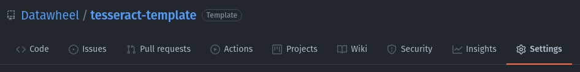
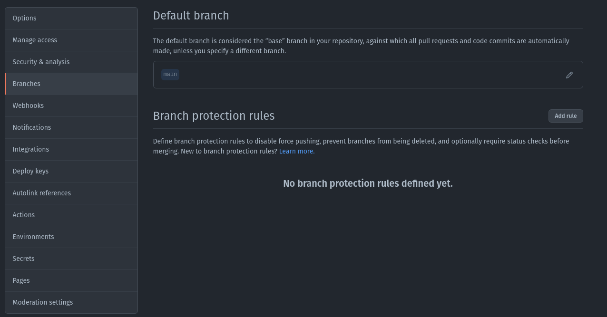
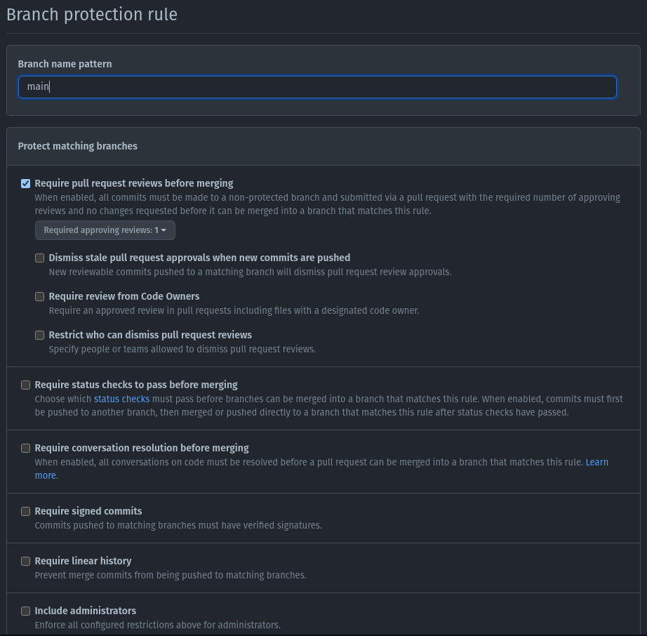
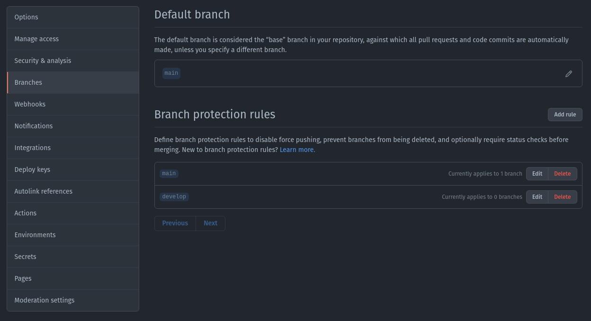

# Creating the specific rules required for develop branch

Do the same for develop branch

If you want to apply the same behaviour to admins

More documentation at [github](https://docs.github.com/en/github/administering-a-repository/defining-the-mergeability-of-pull-requests/managing-a-branch-protection-rule).