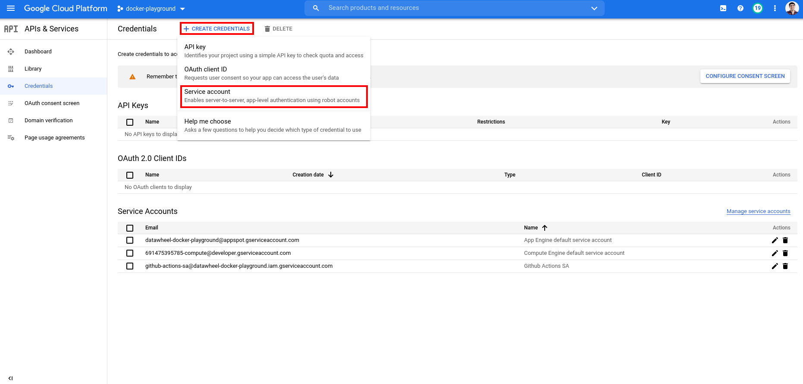
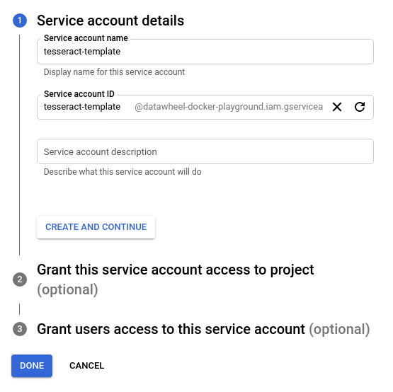
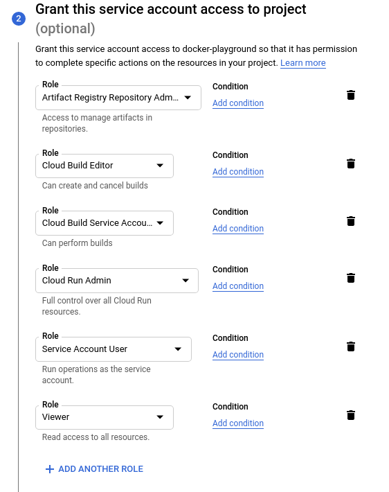
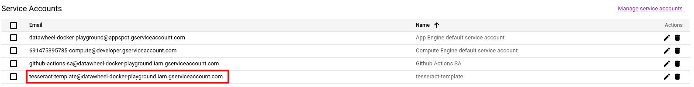
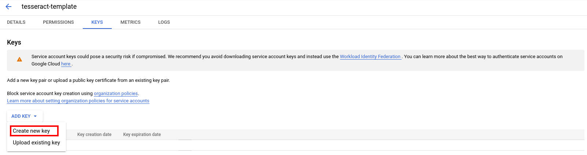
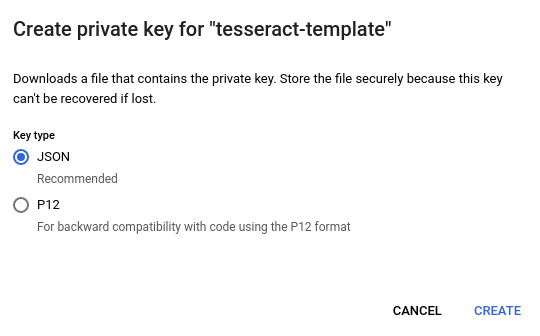
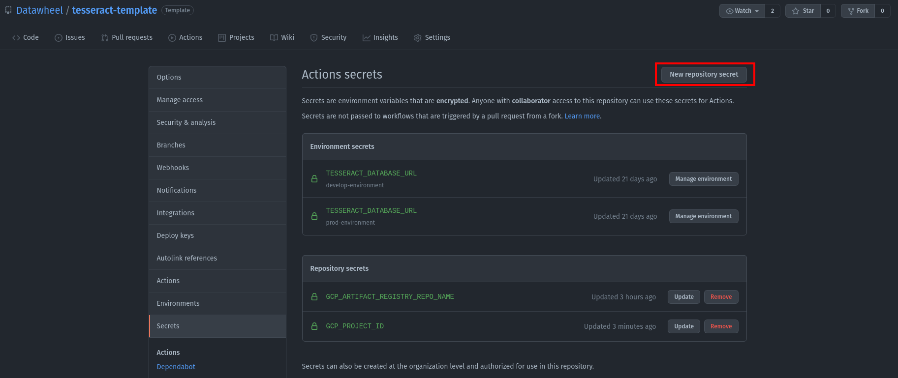
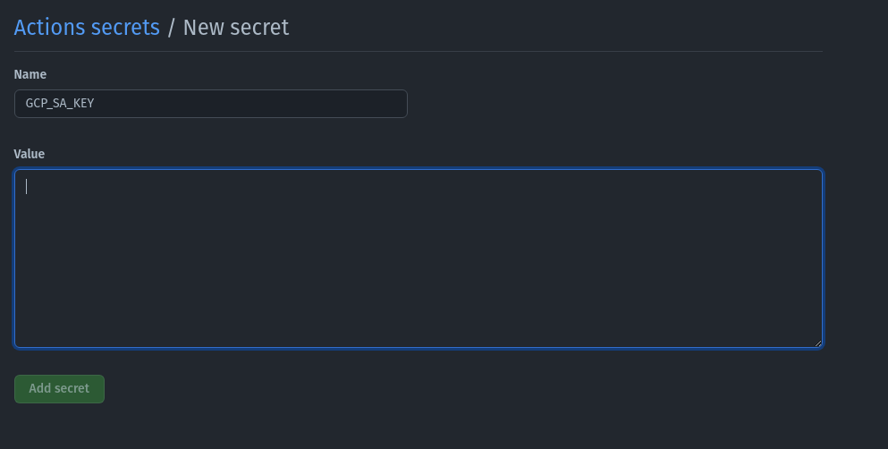

Save the file on your local machine *IMPORTANT: DO NOT SHARE THIS FILE AND KEEP IT WELL STORAGED*
Use the [command line](https://linuxhint.com/bash_base64_encode_decode/) to base64 encode this JSON into a single string, then copy this string into a repo secret called GCP_SA_KEY

base64 tesseract-template-sa.gcp.json > tesseract-template-sa.gcp.encoded

